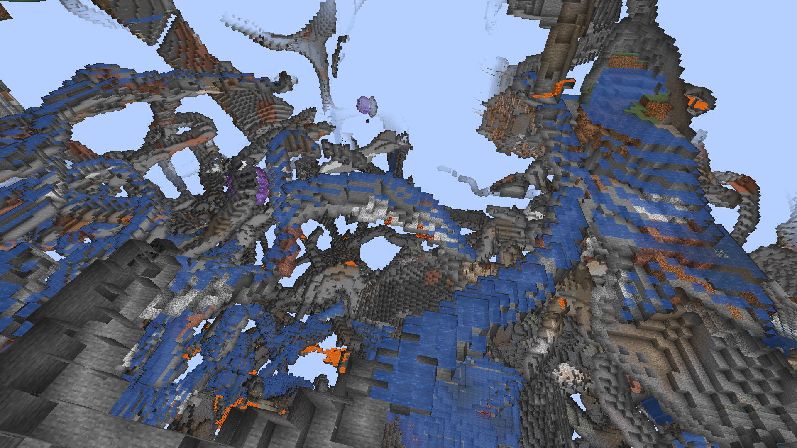
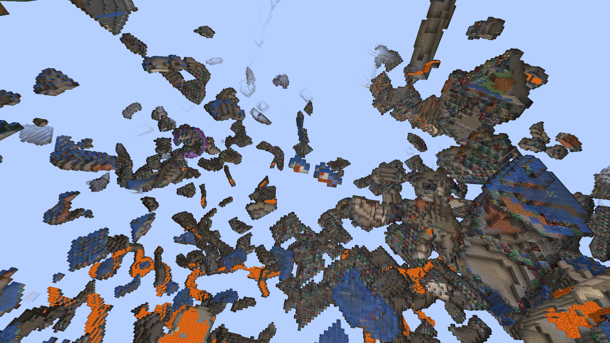
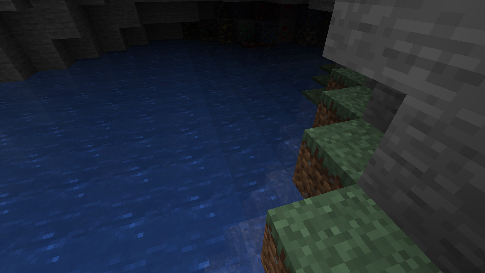
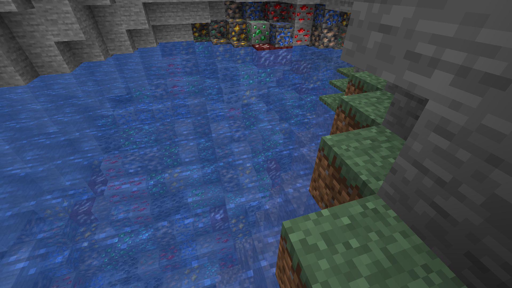
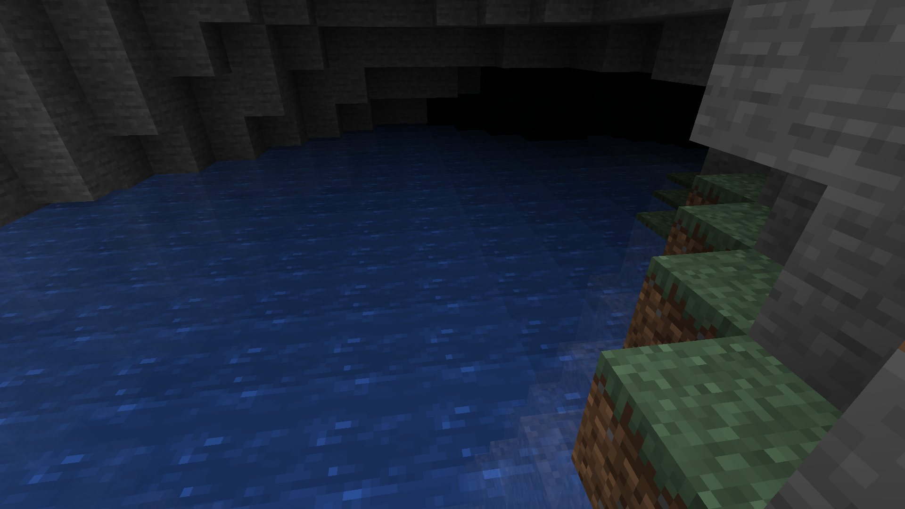
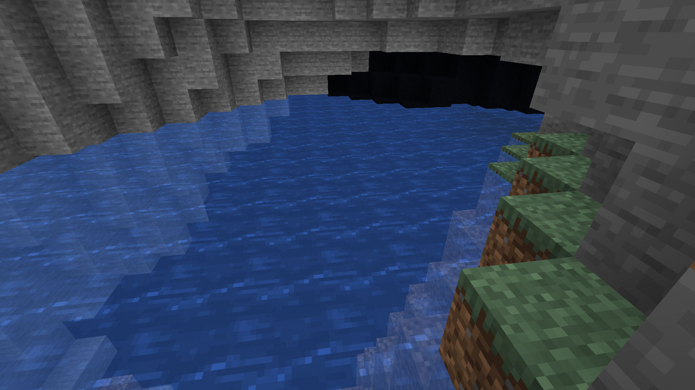

# SSAntiCheat

This project is not that usabile.

## Anti XRay

An anti XRay module, that is probably very resource heavy!

### Commands

- `/ssanticheat enable xray`
- `/ssanticheat disable xray`
- `/ssanticheat xray set_mode light`

  If the block light level is 0 the block will be hidden.

- `/ssanticheat xray set_mode visible`

  If the block cannot be seen will be hidden.

- `/ssanticheat xray set_shadow random [<blocks>]`

  The block chosen to hide with will be randomly selected.
  If the `[<blocks>]` is empty the default minecraft ores will be added to the list.
  The blocks needs to be opaque!

- `/ssanticheat xray set_shadow solid <block>`

  Any hidden block will be replaced with the specified block.
  The block needs to be opaque!

### Images

  Under the world with night vision.

  Under the world with night vision and anti XRay.
  - `/ssanticheat enable xray`
  - `/ssanticheat xray set_mode light`
  - `/ssanticheat xray set_shadow random`

  - `/ssanticheat enable xray`
  - `/ssanticheat xray set_mode light`
  - `/ssanticheat xray set_shadow random`

  With night vision.
  - `/ssanticheat enable xray`
  - `/ssanticheat xray set_mode light`
  - `/ssanticheat xray set_shadow random`

  - `/ssanticheat enable xray`
  - `/ssanticheat xray set_mode light`
  - `/ssanticheat xray set_shadow solid minecraft:black_concrete`

  With night vision.
  - `/ssanticheat enable xray`
  - `/ssanticheat xray set_mode light`
  - `/ssanticheat xray set_shadow solid minecraft:black_concrete`
